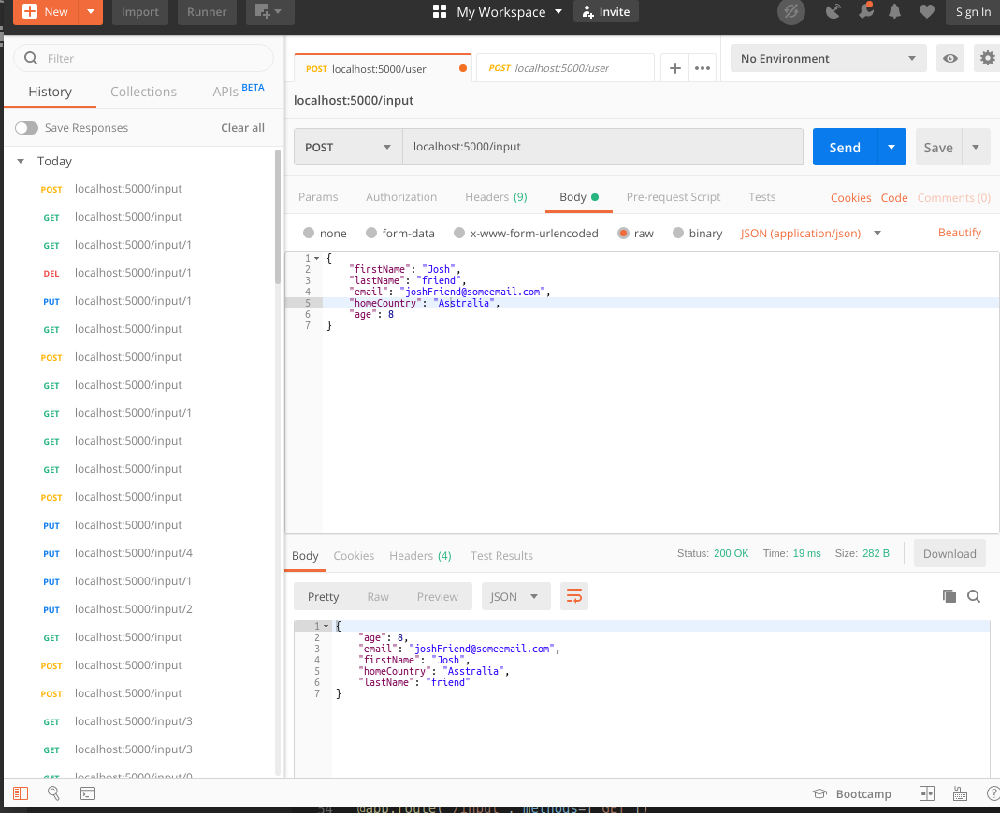
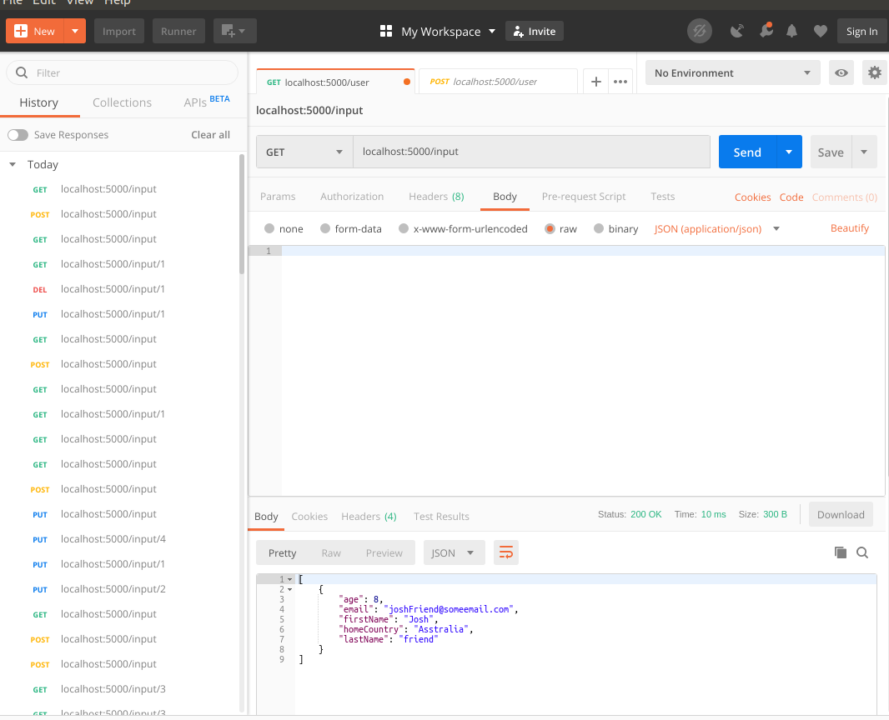
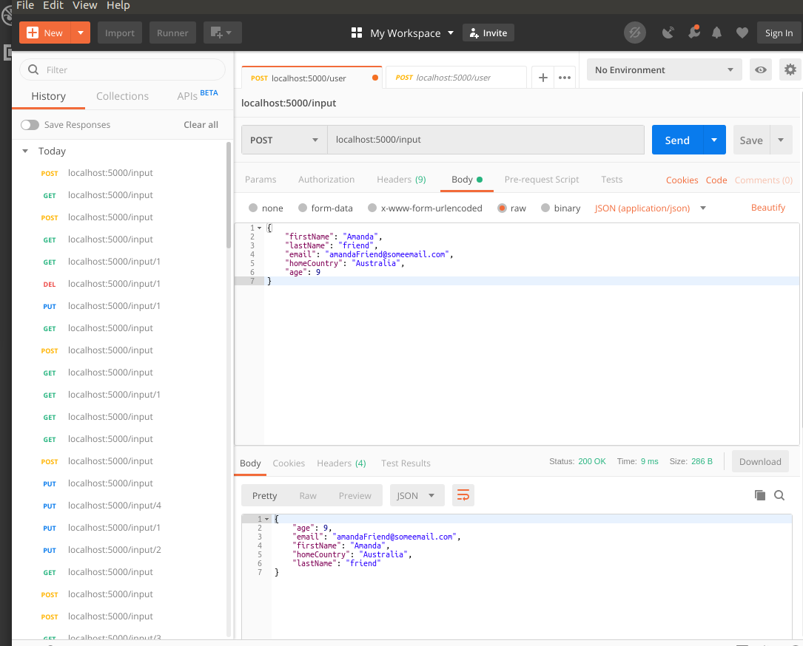
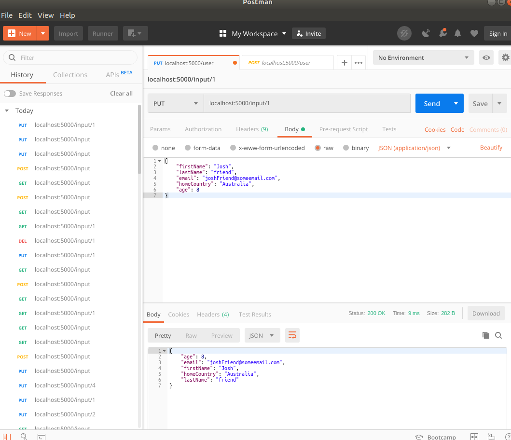
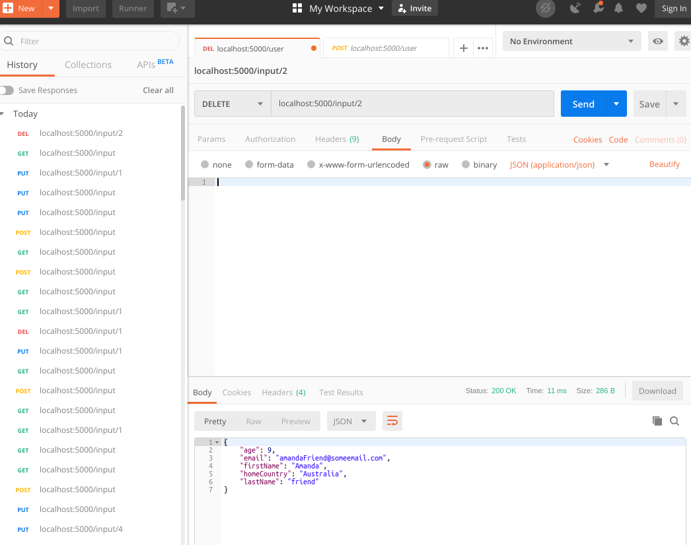
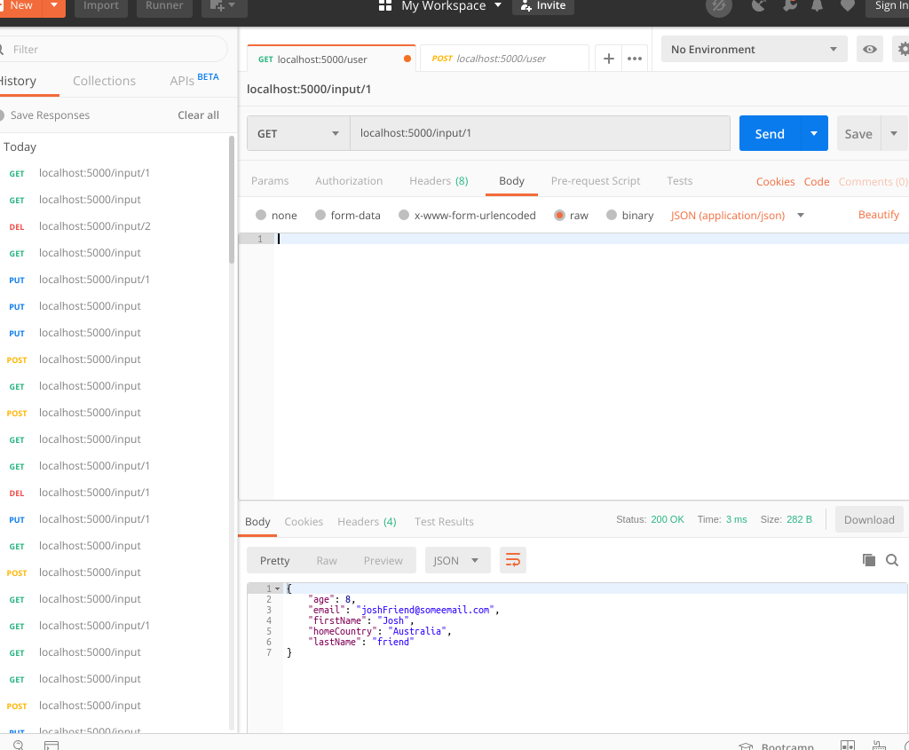

# crudExample App

crudExample is a simple CRUD app using the REST api via python and flask. 

## Installation

Use git to clone the repository https://github.com/BartekJimenez/crudExample.git

```bash
git clone https://github.com/BartekJimenez/crudExample.git
```

## Setup

Make sure you have the following python packages:
- requests
- flask
- flask_sqlalchemy
- flask_marshmallow
- marshmallow-sqlalchemy

pip commands for non-windows machines:
```bash
pip install requests
pip install flask
pip install flask_sqlalchemy
pip install flask_marshmallow
pip install marshmallow-sqlalchemy
```

Now install the db You can enter python via the console at the root and then:

```python
from crudExample import db
db.create_all()
exit()
```


## Usage


Navigate to the root, and type in your console on windows:
```bash
python crudExample.py

```

If your packages are all installed, you should be running the app. Get the url from the console, it should be : http://127.0.0.1:5000/


## Example 1

Post user Josh:



Get all users:



Add another user Amanda:



Update Josh's incorrect spelling in 'Australia':

 


Delete Amanda:



Search by Josh's ID:



Search by all:


##Q&A
* a. How do you typically manage dependencies for a project? 

  * For Java I would use Maven, for Python we can use pipenv.

* b. Provide a top 3 of your favorite resources (blogs, books, people, etc...) that you use to improve as an engineer. Please tell why you like that particular resource. 

  * Googling various different topics regarding programming, e.g. browsing Stackoverflow. I find that you encounter many real-world examples from everyday people, presented in very different ways. It lets you see and think as others and see where and how they're making mistakes. 
  * I have gotten some courses on sale from Udemy, which I felt were direct to the point and allowed me to begin learning other subject matters. Of course, a lot of these courses were reinforced with further research.
  * I try to speak with as many people in the field as possible, and to ask what they are doing and how are they building their career. I think it's important to review what people 'ahead' of you are doing, because you can evaluate what they did to get there and if it's the best path for you to take. It also lets you get a 'personal' feeling for different areas of interest, when you are able to maintain personal relationships with engineers of various focuses. 


* c. How would you test a piece of code that required access to a remote database through a network connection?
  * I would use both unit testing and selenium webdriver. 


