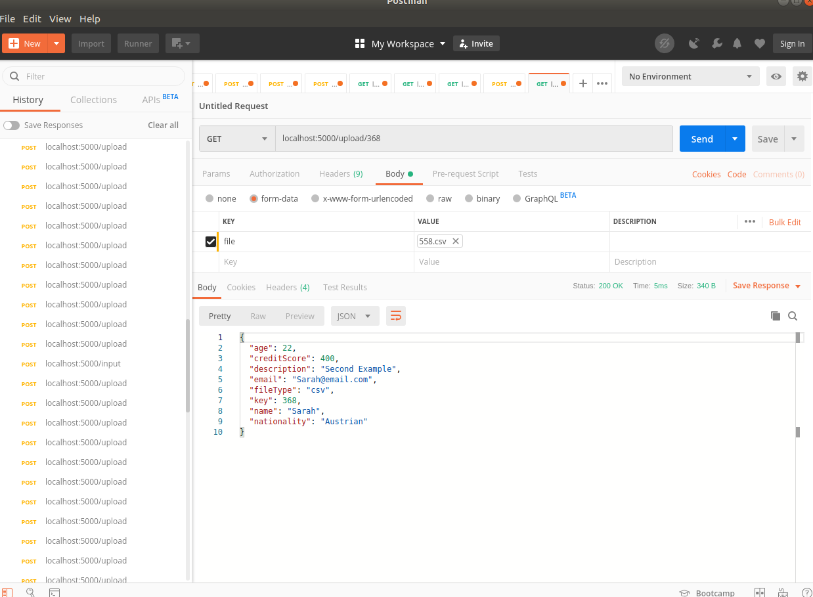

# crudExample App

crudExample is a simple CRUD app using the REST api via python and flask. 

## Installation

Use git to clone the repository https://github.com/BartekJimenez/crudExample.git

```bash
git clone https://github.com/BartekJimenez/crudExample.git
```

## Setup

Make sure you have the following python packages(most of these are included in Anaconda if you have that, if not all):
- requests
- flask
- flask_sqlalchemy
- flask_marshmallow
- marshmallow-sqlalchemy
- werkzeug
- pandas
- numpy

pip commands for non-windows machines:
```bash
pip install requests
pip install flask
pip install flask_sqlalchemy
pip install flask_marshmallow
pip install marshmallow-sqlalchemy
pip install Werkzeug
pip install pandas
pip install numpy
```

Now to install the db. Just run this in your console:

```bash
python createDB.py
```

It should run and create your database(sqlite) for you.

## Usage


Navigate to the root, and type in your console on windows:
```bash
python crudExample.py

```

If your packages are all installed, you should be running the app. Get the url from the console, it should be : http://127.0.0.1:5000/


## Example of phase 1

All examples will be done via Postman.

Post user 558:


Afterwards, we can add three more users the same way and then view them all via GET:


We can also use PUT to edit the description (or any field we desire to edit):


We can also delete an entry via DELETE:


## Example of phase 2

Now that we have some of the file meta-data, we can begin uploading files:


What's happening is that how notice we upload our file 368.csv? The name of the file is the key, and it must match one of the entered meta-data sets otherwise it will not go through. We can now add more data, and GET it all:


We sent the file via postman, and our application parsed and matched it up with our phase 1 entry via the key. It then inputted that data into our phase 2 database, and finally finished the operation by removing the 'old' data from phase 1. We can see that simply by doing GET from the input endpoint:


That is all! We can also get data with the key for both projects as show in the two screenshots below:




## Q&A
* a. How do you typically manage dependencies for a project? 

  * For Java I would use Maven, for Python we can use pipenv.

* b. Provide a top 3 of your favorite resources (blogs, books, people, etc...) that you use to improve as an engineer. Please tell why you like that particular resource. 

  * Googling various different topics regarding programming, e.g. browsing Stackoverflow. I find that you encounter many real-world examples from everyday people, presented in very different ways. It lets you see and think as others and see where and how they're making mistakes. 
  * I have gotten some courses on sale from Udemy, which I felt were directly to the point and allowed me to begin learning other subject matters. Of course, a lot of these courses were reinforced with further research but Udemy gave me a good starting point.
  * I try to speak with as many people in the field as possible, and I ask what they are doing and how are they are building their career. I think it's important to review what people 'ahead' of you are doing, because you can evaluate what they did to get there and if it's the best path for you to take. It also lets you get a 'personal' feeling for different areas of interest, on a much lower level.  


* c. How would you test a piece of code that required access to a remote database through a network connection?
  * I would use both unit testing and selenium webdriver. 

## TODOS

Add validations and appropriate error handling. Perhaps revisit how data is parsed and see if you can make it more flexible and scalable. 

